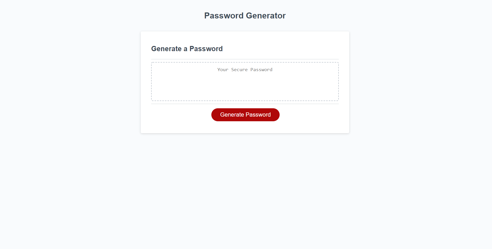

# [03_password_generator](https://millsy4.github.io/03_password_generator/)

This is a website that takes user input from certrain criteria in order to create a randomized password that meets the requirements.  In order to utilize this website, the user must first click the Generate Password button, then the user will be prompted to answer a series of 5 questions, and then the program will display a randomized password based on the entered parameters.

Tools I used to complete this include:

- [Javascript](https://www.javascript.com/)

The main objective of this homework was to learn how to effectively make Javascript functions and utilize Javascript coding.  It is essential when learning to design websites to understand Javascript and to fully utilize its capabilities.

There is only one page for the website because the website is very simplistic in nature, but the main idea was to really focus on the back-end Javascript.  This website will be good to use later on because it has the basics of Javascript within it and can be used as a building block for later websites and functions.

